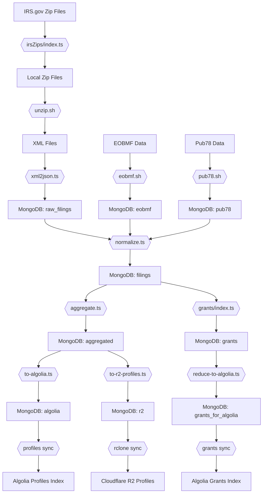

# Grantmakers.io NEXT

## ETL Pipeline

### Overview

The IRS publishes nonprofit tax filings publicly at IRS.gov[1]. Grantmakers.io currently focuses exclusively on Form 990-PF, the form filed by private foundations.

The Grantmakers.io ETL Pipeline transforms the raw XML data into structured MongoDB collections. These collections are then exported to:

1. Cloudflare R2 as individual JSON files
2. Algolia as search-optimized JS objects

### Prerequisites

- MongoDB running locally
- Node.js with tsx
- Bash shell
- rclone configured for Cloudflare R2
- Algolia credentials

### IRS Source

[1] https://www.irs.gov/charities-non-profits/form-990-series-downloads

## Pipeline Workflow

